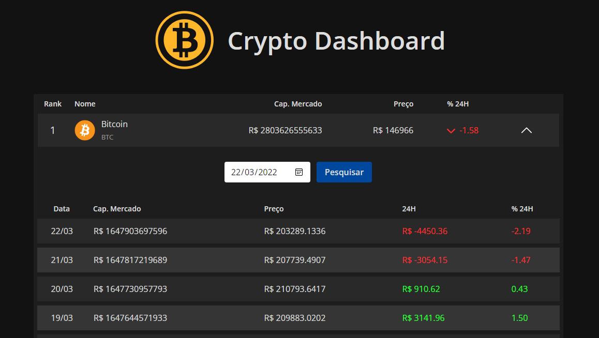
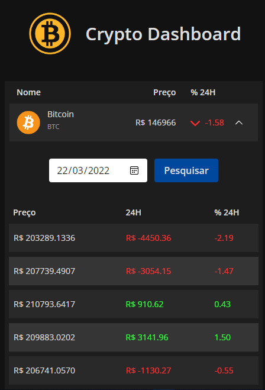

# Crypto Dashboard

Aplicação desenvolvida em Vue JS que consiste na exibição de preços e histórico informativo de criptomoedas.

Web app: [Crypto Dashboard (Vercel)](https://coin-price-app.vercel.app/)

## Features

* Atualização automática dos preços e tabelas

* Layout responsivo

* Pesquisa de histórico por data

## Tecnologias utilizadas

* Vue.JS
* Vite
- Tailwind css
    - TW elements

* Moment.js

API: [CoinGecko](https://www.coingecko.com/pt/api)


## Instalação local

- Tenha o [Node.js](https://nodejs.dev/) instalado em seu computador.

- Faça o clone do repositório atráves do terminal do [Git](https://git-scm.com/downloads) ou baixe a versão [ZIP](https://github.com/C836/Crypto-Dashboard/archive/refs/heads/main.zip).

```
$ git clone https://github.com/C836/Todo-API
```

- Navegue pelos arquivos até a raiz da aplicação, instale as dependências necessárias e inicie o projeto.

```
$ npm install
$ npm start
```

## Layout

Desktop             |  Mobile
:-------------------------:|:-------------------------:
  |  